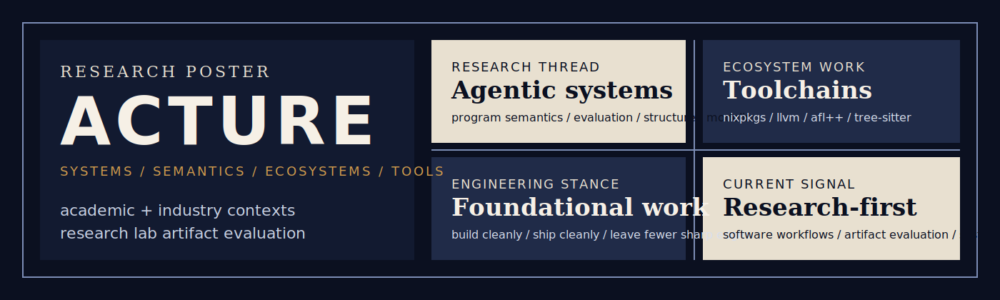

  

<h1 align="center">acture</h1>

  <strong>research systems × ecosystem engineering × semantics-aware infrastructure</strong>

<table>
  <tr>
    <td width="64%" valign="top">
      <strong>Research-oriented systems, built to survive real workflows.</strong> 
      I build research systems and evaluation artifacts, then push the same taste for rigor into compiler,
      packaging, fuzzing, and language-tooling work.  
      Currently working on artifact evaluation in a research lab setting, with a background spanning academic and
      industry software workflows.
    </td>
    <td width="36%" valign="top">
      <strong>Current signal</strong> 
      agent systems 
      program semantics 
      ecosystem work 
      artifact evaluation  
      <strong>Reach</strong> 
      <a href="mailto:acturea@gmail.com">acturea@gmail.com</a> 
      WeChat available on request
    </td>
  </tr>
</table>

  <code>research // semantics // toolchains // static analysis // workflow automation</code>

  <a href="#research-thread">Research</a> ·
  <a href="#ecosystem-work">Ecosystem</a> ·
  <a href="#collaboration">Collaboration</a>

## Research Thread

> Some active work stays intentionally abstract here while under review.
> The stable through-line is a recurring set of technical problems, not a list of titles.

<table>
  <tr>
    <td width="50%" valign="top">
      <strong>Agentic Software Engineering</strong> 
      orchestrated workflows for program transformation, inspection, and constrained automation
    </td>
    <td width="50%" valign="top">
      <strong>Benchmark &amp; Artifact Design</strong> 
      evaluation setups built for reproducibility, diagnosability, and real execution constraints
    </td>
  </tr>
  <tr>
    <td width="50%" valign="top">
      <strong>Program Semantics</strong> 
      semantics-aware translation, reconstruction, and transformation rather than surface-only rewriting
    </td>
    <td width="50%" valign="top">
      <strong>Language-Centric Modeling</strong> 
      semantic understanding and structured modeling for language-heavy or annotation-heavy tasks
    </td>
  </tr>
</table>

## Ecosystem Work

I do not treat ecosystem work as a side quest. When the right fix belongs upstream, I would rather land it there than keep a private workaround alive forever. When the ecosystem needs a missing layer, I would rather build it cleanly than leave the gap in place.

<table>
  <tr>
    <td width="50%" valign="top">
      <strong>Nix / nixpkgs</strong> 
      compiler packaging, version bring-up, and runtime support work around <code>flang</code> and related toolchain edges
    </td>
    <td width="50%" valign="top">
      <strong>LLVM / MLIR / Flang</strong> 
      build-system and integration fixes aimed at removing downstream friction instead of papering over it locally
    </td>
  </tr>
  <tr>
    <td width="50%" valign="top">
      <strong>AFL++</strong> 
      low-level fuzzing and runtime-path fixes in systems code where small mistakes quietly become real debugging costs
    </td>
    <td width="50%" valign="top">
      <strong>Tree-sitter ecosystem</strong> 
      grammar authoring, binding maintenance, and parser-upgrade work for domain-specific language tooling
    </td>
  </tr>
</table>

This is the kind of engineering I enjoy most: work that becomes foundational for other engineers, even when the surface area looks small.

  
Selected links

  <ul>
    <li><code>nixpkgs</code>: <a href="https://github.com/NixOS/nixpkgs/pull/428306">#428306</a>, <a href="https://github.com/NixOS/nixpkgs/pull/452306">#452306</a></li>
    <li><code>llvm-project</code>: <a href="https://github.com/llvm/llvm-project/pull/154412">#154412</a>, <a href="https://github.com/llvm/llvm-project/pull/150987">#150987</a></li>
    <li><code>AFLplusplus</code>: <a href="https://github.com/AFLplusplus/AFLplusplus/pull/2073">#2073</a></li>
    <li><code>tree-sitter-paradox</code>: <a href="https://github.com/Acture/tree-sitter-paradox">repository</a></li>
    <li><code>tree-sitter-llvm</code>: <a href="https://github.com/benwilliamgraham/tree-sitter-llvm/pull/9">#9</a>, <a href="https://github.com/benwilliamgraham/tree-sitter-llvm/pull/10">#10</a>, <a href="https://github.com/benwilliamgraham/tree-sitter-llvm/pull/12">#12</a></li>
  </ul>

## Collaboration

<table>
  <tr>
    <td width="50%" valign="top">
      <strong>Open to</strong> 
      research collaboration on systems, tooling, and evaluation 
      benchmark, artifact, and reproducibility work 
      developer tooling, language infrastructure, and static analysis
    </td>
    <td width="50%" valign="top">
      <strong>Reach</strong> 
      <a href="mailto:acturea@gmail.com">acturea@gmail.com</a> 
      WeChat available on request
    </td>
  </tr>
</table>

## Public Utilities

These are supporting public artifacts rather than the center of the profile: small, opinionated tools that reflect how I like workflows to behave.

<table>
  <tr>
    <td width="50%" valign="top">
      <strong><a href="https://github.com/Acture/review-loop">review-loop</a></strong> 
      review submission and retrieval with durable local state 
      Rust, SQLite
    </td>
    <td width="50%" valign="top">
      <strong><a href="https://github.com/Acture/char-cloud">char-cloud</a></strong> 
      reproducible, shape-constrained SVG word clouds 
      Rust, SVG
    </td>
  </tr>
  <tr>
    <td width="50%" valign="top">
      <strong><a href="https://github.com/Acture/d2typ">d2typ</a></strong> 
      structured data into Typst-ready documents 
      Rust, Typst
    </td>
    <td width="50%" valign="top">
      <strong><a href="https://github.com/Acture/tree-sitter-paradox">tree-sitter-paradox</a></strong> 
      a grammar and bindings for Paradox scripting languages 
      Tree-sitter, JavaScript, C
    </td>
  </tr>
  <tr>
    <td width="50%" valign="top">
      <strong><a href="https://github.com/Acture/scriptmark">scriptmark</a></strong> 
      grading support for scriptable evaluation loops 
      Python
    </td>
    <td width="50%" valign="top">
      <strong><a href="https://github.com/Acture/modus-foch">modus-foch</a></strong> 
      static analysis for Paradox mod dependency integrity 
      Rust
    </td>
  </tr>
</table>
