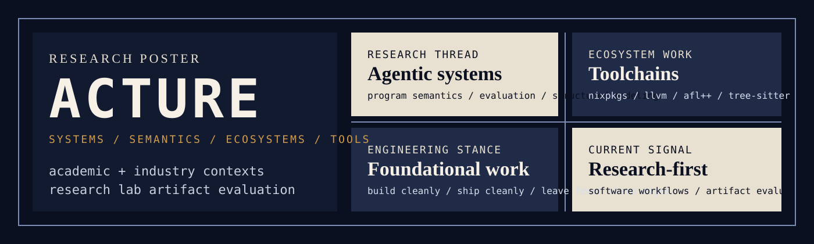
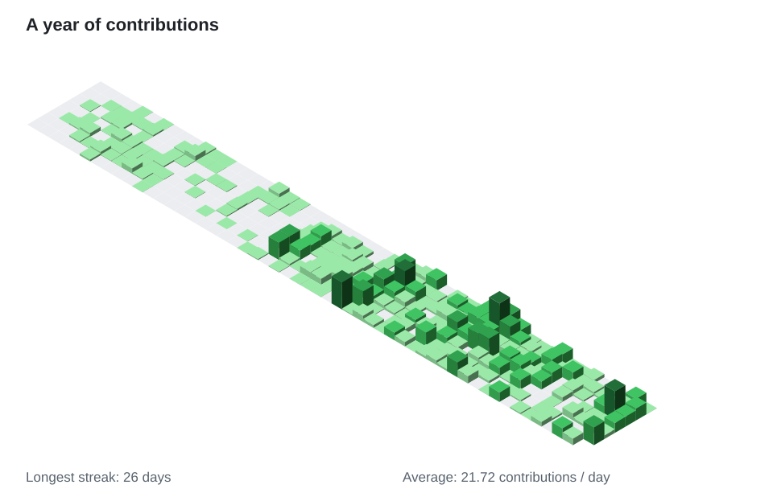
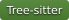
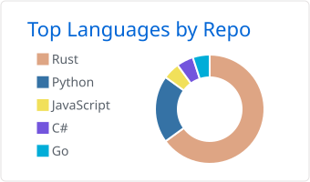
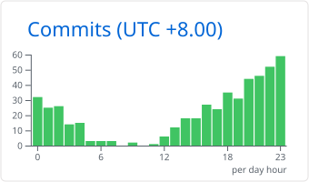
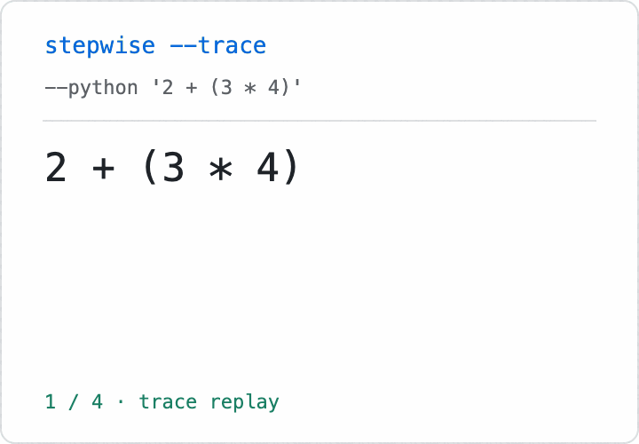
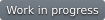

<picture>
  <source media="(prefers-reduced-motion: reduce) and (prefers-color-scheme: dark)" srcset="./assets/profile-hero-dark-static.svg" />
  <source media="(prefers-reduced-motion: reduce)" srcset="./assets/profile-hero-static.svg" />
  <source media="(prefers-color-scheme: dark)" srcset="./assets/profile-hero-dark.svg" />
  <source media="(prefers-color-scheme: light)" srcset="./assets/profile-hero.svg" />
  
</picture>

<table align="right" width="32%">
<tr><td align="center">
<h4>Between commits</h4>

<picture>
  <source media="(prefers-color-scheme: dark)" srcset="./assets/github-snake-dark.svg" />
  <source media="(prefers-color-scheme: light)" srcset="./assets/github-snake.svg" />
  
</picture>
</td></tr>
</table>

I'm a researcher and engineer working on **LLM agent reliability and program semantics**.
I study how agents use software and how program behavior changes across
languages and execution environments.

My work connects **evaluation design and systems implementation**. I design
experiments and build tools for tracing execution and analyzing programs,
with the aim of making research results easier to inspect, explain, and reproduce.

I share some of my work here, alongside tools I build for research and
everyday use. Rust and Python are my usual starting points; TypeScript and
Swift come in for interfaces.

 

[Research](#-research) · [Engineering](#-engineering) · [Projects](#-projects) · [Collaboration](#-collaboration)

---

### `/// RESEARCH`

 

---

### `/// ENGINEERING`

#### Language and systems tools

I build parsers, compiler tooling, and cross-language bindings to inspect
and work with programs. I’m interested in where runtime behavior and
language semantics affect what a transformation or an interface preserves.

#### Experimental infrastructure

<code>Controlled environments</code> <code>Process tracing</code> <code>Benchmark harnesses</code>

I build evaluation harnesses with controlled environments, process tracing,
and inspectable execution records. They let me investigate failures and
compare behavior across implementations and environments, connecting an
experimental result to the system that produced it.

#### Native and terminal interfaces

I build terminal interfaces, Tauri desktop apps, and native Swift/AppKit
software. A shared Rust core lets me bring the same underlying behavior to
different workflows, from a command line to a desktop interface.

---

### `/// OPEN-SOURCE CONTRIBUTIONS`

I also work in established codebases, contributing to the compiler,
packaging, fuzzing, and parsing tools that my own work depends on.

<picture>
  <source media="(prefers-color-scheme: dark)" srcset="./assets/summary-languages-dark.svg" />
  <source media="(prefers-color-scheme: light)" srcset="./assets/summary-languages.svg" />
  
</picture>
<picture>
  <source media="(prefers-color-scheme: dark)" srcset="./assets/summary-time-dark.svg" />
  <source media="(prefers-color-scheme: light)" srcset="./assets/summary-time.svg" />
  
</picture>

---

### `/// PROJECTS`

A few places to see how I work, or find something to build on:

- **⊢** [**Stepwise**](https://github.com/Acture/Stepwise)   
  My work on learning Python evaluation and natural deduction through individually checked steps. 
  <picture>
    <source media="(prefers-reduced-motion: reduce) and (prefers-color-scheme: dark)" srcset="./assets/stepwise-trace-dark.png" />
    <source media="(prefers-reduced-motion: reduce)" srcset="./assets/stepwise-trace-light.png" />
    <source media="(prefers-color-scheme: dark)" srcset="./assets/stepwise-trace-dark.gif" />
    <source media="(prefers-color-scheme: light)" srcset="./assets/stepwise-trace-light.gif" />
    
  </picture>
- **⧉** [**Foch**](https://github.com/Acture/foch)   
  Script analysis and merge tooling for Europa Universalis IV. 
  <em>Some people play Europa Universalis IV. I also ended up writing tooling for its mod files.</em>
- **▦** [**Teaser**](https://github.com/Acture/teaser)   
  I’m building a macOS environment around complete project workspaces.
- **⌘** [**ScriptMark**](https://github.com/Acture/scriptmark)   
  My tooling for grading programming assignments and inspecting the execution evidence behind a grade.
- **◫** [**tree-sitter-paradox**](https://github.com/Acture/tree-sitter-paradox)  
  A reusable grammar I maintain for Paradox scripts and their editor integrations.

---

### `/// COLLABORATION`

An agent evaluation to untangle, a language tool to build, or an EU4 mod that refuses to merge?

I’m especially interested in collaborations that need **experimental design
and implementation together**: developing an evaluation, investigating a
failure, or building the tooling behind a research idea.

I'd like to hear about it. **[acturea@gmail.com](mailto:acturea@gmail.com)**
